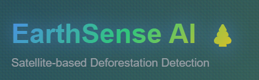
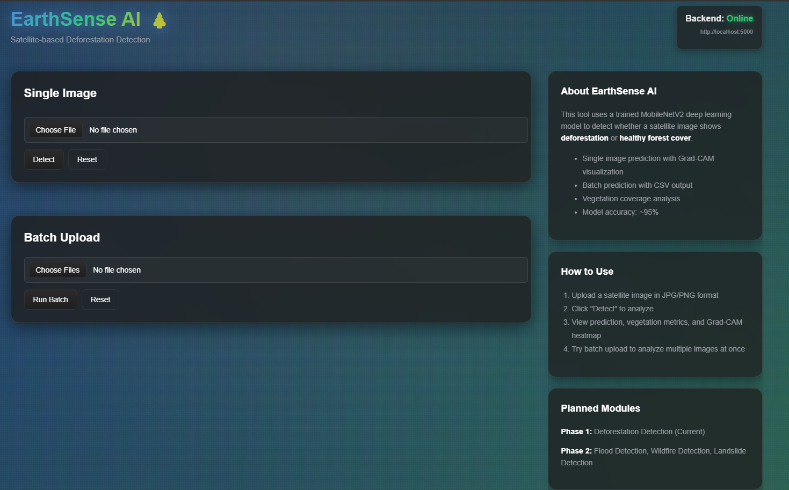
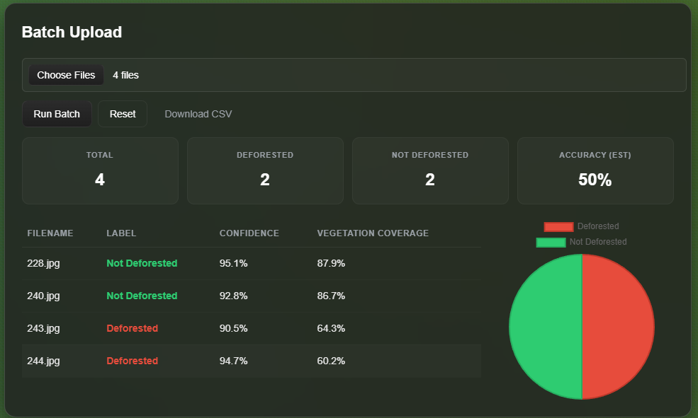

```md
<div align="center">

# 🌍 **EarthSense AI**  
### *Satellite-based Deforestation Detection System*  
**Real-Time AI for Environmental Monitoring**

Built for **SkyHack 2025 — AI/ML for Space Data Interpretation**

---



</div>

---

## 🚀 **Overview**

**EarthSense AI** is an end-to-end deep learning pipeline that detects **deforestation from satellite images** in real time.  
It transforms Earth observation imagery into **actionable environmental insights** through:

✔ AI-powered detection  
✔ Vegetation cover estimation  
✔ Grad-CAM explainability  
✔ Clean frontend for demos  
✔ Batch analysis with CSV export  

---

## 🎯 **Key Features**

- ⚡ **Instant Deforestation Prediction**  
- 🌿 **Vegetation Cover Estimation** (green pixel ratio)  
- 🔥 **Explainable AI (Grad-CAM)** heatmaps  
- 📂 **Batch Processing with CSV export**  
- 💻 **Modern React + Vite Frontend**  
- 🛰️ Works with any satellite/top-down image  

---

## 🖼️ **Screenshots**

All images must be inside the `images/` folder.

---

### 🏠 **Homepage**
<p align="center">
  
</p>

---

### 🖼️ **Single Image Prediction**
<p align="center">
  
</p>

---

### 📦 **Batch Processing**
<p align="center">
  
</p>

---

## 🧩 **Problem Statement**

Global deforestation is accelerating climate change, threatening biodiversity, and destabilizing ecosystems.  
Manual analysis of satellite imagery is slow, inconsistent, and impossible at large scales.

👉 **EarthSense AI automates detection, visualization, and interpretation.**

---

## 🧭 **How EarthSense Works**

1. User uploads a satellite image (or multiple).  
2. System preprocesses (resize, normalize).  
3. CNN model predicts: **Deforested / Not Deforested**.  
4. Vegetation percentage is calculated using HSV green masking.  
5. Grad-CAM heatmap highlights important regions.  
6. Results returned to frontend with metrics + images.  

---

## 🧬 **Technical Overview**

| Component | Technology |
|----------|------------|
| **Model** | TensorFlow/Keras CNN (transfer learning) |
| **Explainability** | Grad-CAM heatmaps |
| **Vegetation** | HSV mask + ratio |
| **Backend** | Flask API (predict + batch) |
| **Frontend** | React + Vite |
| **Image Processing** | OpenCV + Pillow |

---

## 📁 **Project Structure**

```

earthsense-ai/
│
├── backend/
│   ├── app.py
│   ├── utils.py
│   ├── requirements.txt
│   ├── model/
│   │   └── class_indices.json
│   └── .env
│
├── frontend/
│   ├── index.html
│   ├── package.json
│   ├── vite.config.js
│   └── src/
│       ├── App.jsx
│       ├── api.jsx
│       └── components/
│           ├── UploadCard.jsx
│           └── BatchUpload.jsx
│
└── README.md

````

---

## 📊 **Example API Output**

```json
{
  "prediction": "Deforested",
  "confidence": 0.9321,
  "vegetation_fraction": 0.147,
  "gradcam_base64": "<base64>",
  "inference_time_ms": 312
}
````

---

## 🛠️ **Development Workflow**

### **Phase 1 — Research**

* Dataset survey
* Selected deforestation for better demo clarity

### **Phase 2 — Model**

* Preprocessing pipeline
* Transfer learning (MobileNetV2)
* Model training + validation

### **Phase 3 — Backend**

* Prediction endpoint
* Batch processing + CSV export
* Grad-CAM utilities

### **Phase 4 — Frontend**

* Upload UI
* Batch dashboard
* Heatmap + metrics visualization

### **Phase 5 — Integration**

* API wiring
* UI polish
* Documentation + Screenshots

---

## 🌍 **Use Cases**

* Conservation monitoring
* Early-warning system for illegal logging
* Government land management
* NGO deforestation audits
* Climate analysis pipelines

---

## 🔭 **Future Enhancements**

* 🌧️ Flood & landslide detection
* 🕒 Time-series change detection
* 📡 SAR-based analysis (radar imagery)
* 🌏 Live global deforestation dashboard
* 👤 User accounts + project-based runs

---

## 👥 **Team**

**Ansuj K Meher**
*AI/ML Engineer, Full-Stack Developer*
📧 **[ansujkmeher@gmail.com](mailto:ansujkmeher@gmail.com)**

---

<div align="center">

## 🌱 *EarthSense AI — Turning Satellite Data into Environmental Intelligence.*

”**.
